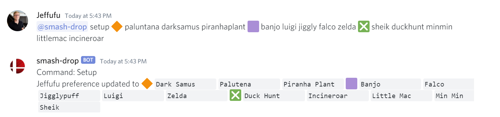
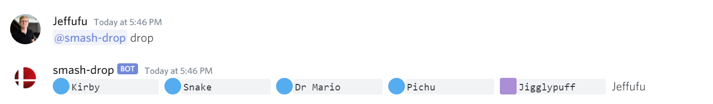
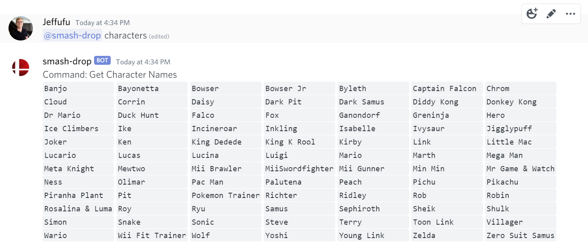

# Smash Drop Discord Bot

Personalized random character picker for Super Smash Bros. Ultimate using Hearthstone pack mechanics.

## Setup

Go to this link and select your server: https://discord.com/oauth2/authorize?client_id=805982500110204928&scope=bot

## Commands

#### User Setup

>Character lists can be found with \`@smash-drop characters\`

Type these discord messages out in a dm to @smash-drop or in any channel.
```
@smash-drop setup 🔶 mario luigi peach 🟪 link zelda sheik younglink toonlink ❎ miibrawler miiswordfighter miigunner littlemac pit
```

🔶= your best 3 characters

🟪= your 5 next best characters

❎= 5 characters you never want to play

>Do not include spaces in the character names



#### Drop
Returns 5 random characters with a guarenteed 🟪 or better.

```
@smash-drop drop
```



You can roll drops for a group of users

```
@smash-drop drop @jeffufu @mlripper @thynix @hasp
```

>Drops will be re-calculated every 60 seconds.  You can get a new drop sooner with `@smash-drop reroll`

#### Reroll
Returns the best 5 characters from 3 drops with a guarenteed 🔶.

```
@smash-drop reroll
```

#### Goldens

Goldens are a rare modifier to your drops.  ✨, 🟨, and 🟡 are golden versions of 🔶, 🟪, and 🔵.

If you play as that golden character run the command

```
@smash-drop add-golden
```

You can check the current number of goldens that you have with

```
@smash-drop get-goldens
```

>Feel free to use goldens for other incentives instead.

#### Preferences

This command shows your current preferences
```
@smash-drop preferences
```
If you want to change those preferences re-run the `@smash-drop setup` command

#### Characters

This command lists all the smash characters setup in this bot
```
@smash-drop characters
```



#### Health

This command tells you if the bot is up and running.
```
@smash-drop health
```
